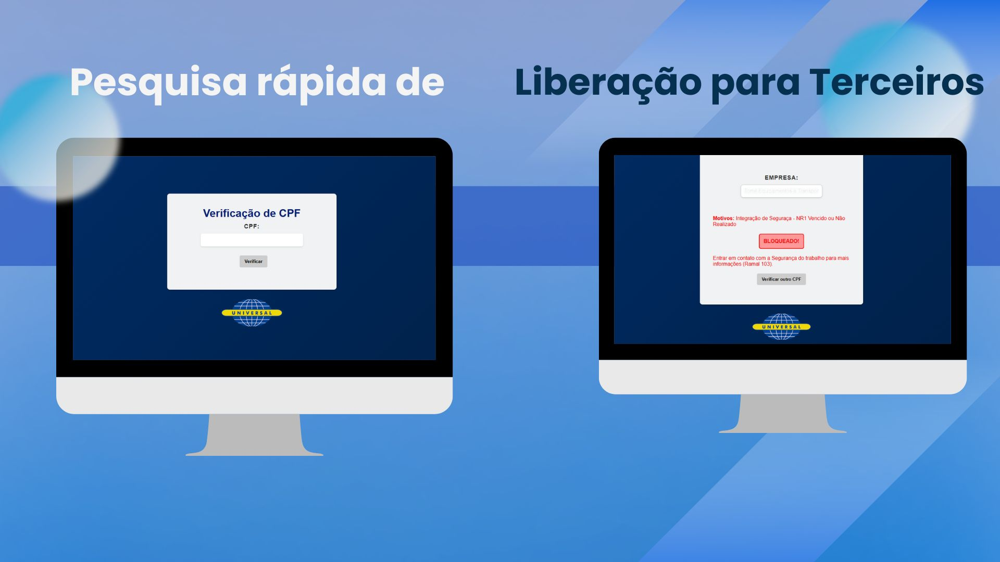

  

  🛡️ CONTROLE DE TERCEIROS 🛡️

  
  
  
  
  

---

## 📜 Descrição do Projeto
Sistema corporativo para **gestão e validação de prestadores de serviço**, com foco em **integração documental**, **ASO** e **certificados**.  
Permite consultar rapidamente, via **CPF**, se um prestador está **liberado** ou **bloqueado**, exibindo **motivos**, **nome** e **empresa** com base em planilha atualizada pela área administrativa.

  

---

## ⚙️ Funcionalidades
- 🔐 **Login e autenticação** de usuários
- 🔍 **Busca automática** em planilha interna pelo CPF
- 📌 Retorno de **status**: Liberado ou Bloqueado
- 📝 Exibição de **motivo da restrição** (ex: documento vencido)
- 📂 Leitura direta de planilha atualizada pela área administrativa
- ⚡ Possibilidade de **atualização rápida** sem alterar código

---

## 🔗 Acesso ao Projeto
A ser definido conforme ambiente de hospedagem 

---

## 🛠️ Tecnologias Utilizadas
- Python **3.13.5**
- Flask
- Pandas 
- HTML5 / CSS3
- Bootstrap

---

## 📜 Licença
Uso interno. Todos os direitos reservados.

